# Streamlining Financial Operations: Leveraging Stripe event destinations with Amazon EventBridge


Stripe is a financial infrastructure platform that provides businesses with the tools to power their online and in person payments, embedded financial services, and custom revenue models. In this fast-paced digital world, customer payment flows require automated workflows to kick off processes such as fulfilling orders after a successful payment, granting user access after a subscription upgrade, or sending notifications for refund processing. Traditionally, customers send Stripe events to webhook endpoints, and in this blog post, we'll explore a new workflow automation using Stripe event destinations.

At AWS, we constantly innovate to help our financial services customers streamline their operations and enhance their customer experiences. Today, we're excited to showcase a powerful integration between Stripe, a leading financial infrastructure platform, and our own Amazon EventBridge - a serverless, event-driven service that helps connect your applications together by ingesting, transforming, and delivering events.

If you're both an AWS and Stripe customer, you can create Stripe event destinations to receive real-time updates about your Stripe accounts directly in Amazon EventBridge. Previously, Stripe only supported sending events to a webhook endpoint. 
By integrating with Amazon EventBridge using Stripe event destinations, you can receive event data from Stripe directly in your AWS account. This eliminates the need to handle traffic and manage integration code logic yourself. When Amazon EventBridge receives events, it can route them to 20 supported targets to process or trigger business automations.
In this blog post, we'll guide you through this integration workflow automation. You'll learn how this solution allows you to receive events reliably and securely within your AWS infrastructure, without the need to manage additional infrastructure or write additional integration code.


# Achitecture Diagram

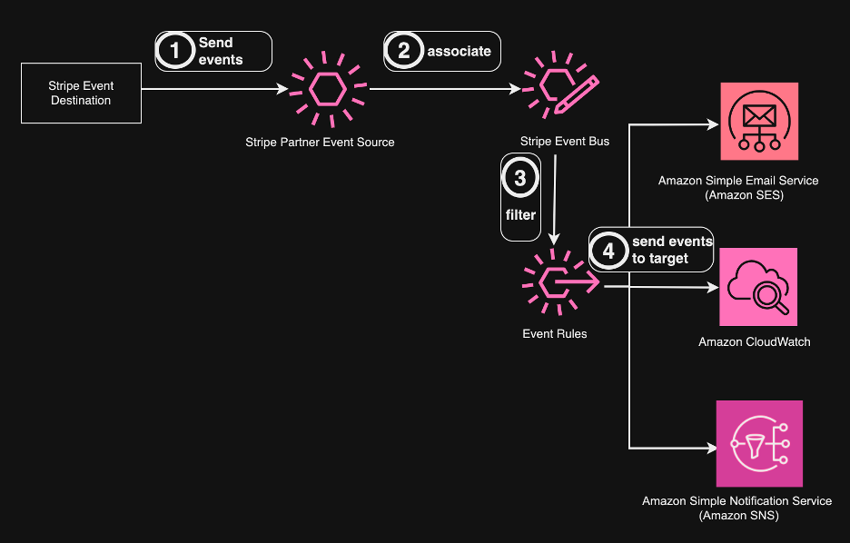

# Prerequisites

An AWS account \
A Stripe account with API access (To set up a new Stripe account, visit https://dashboard.stripe.com/) \
AWS CLI configured with appropriate permissions \
AWS Account user with IAM Policy mentioned in CloudFormation/IAMPolicy.json 

# Create infrastructure using CloudFormation

The following CloudFormation template will create an Event Destination in Stripe to capture new customer creation events (i.e., customer.created). These events will be sent to AWS EventBridge and logged in a CloudWatch LogGroup.

Setup Steps ,

1. First, download the CloudFormation template Cloudformation.yaml.

2. Then upload it in CloudFormation to create a stack. This stack sets up the necessary infrastructure, such as IAM roles , Lambda functions, EventBridge Rules and Event Destination in your stripe account. 

Go to CloudFormation console in AWS, click Stacks -> Create stack -> With new resources (standard).

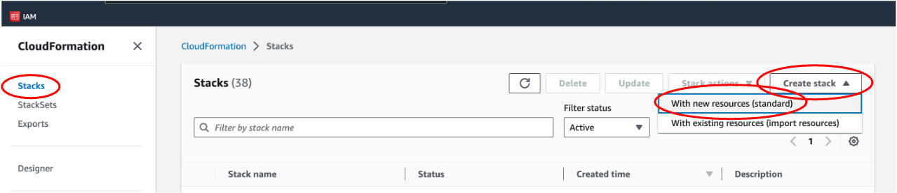

3. Upload *cloudformation.yaml*, and click "Next". 

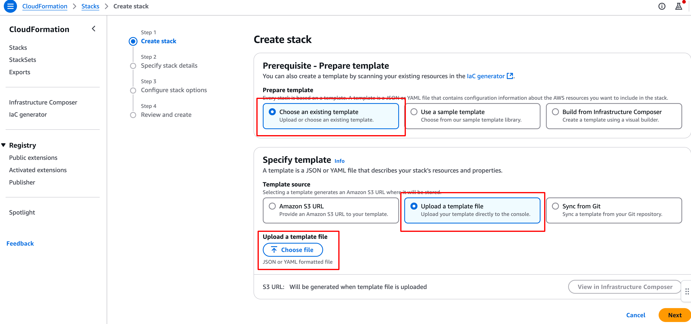

4. In Specify stack details step, enter Stack name . In the parameters section , 

provide EventDestinationName and copy page Secret API Key from Stripe(https://dashboard.stripe.com/) in StripeAPIKey parameter. 

For More Information on Stripe Create Event Destination parameters , please visit https://docs.stripe.com/api/v2/event-destinations


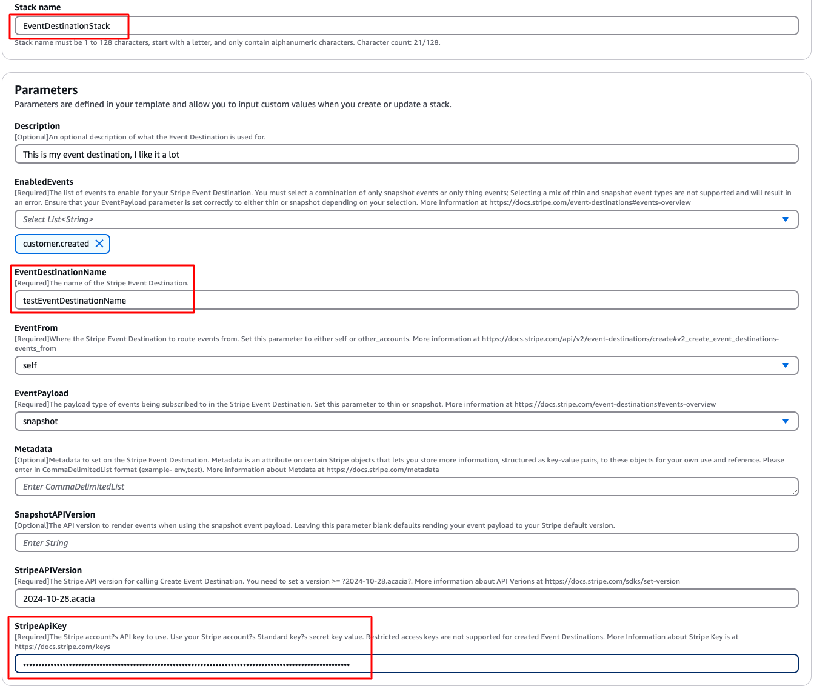

6. In Configure stack options step, check the boxes under Capabilities and transforms section as below. Click Next.

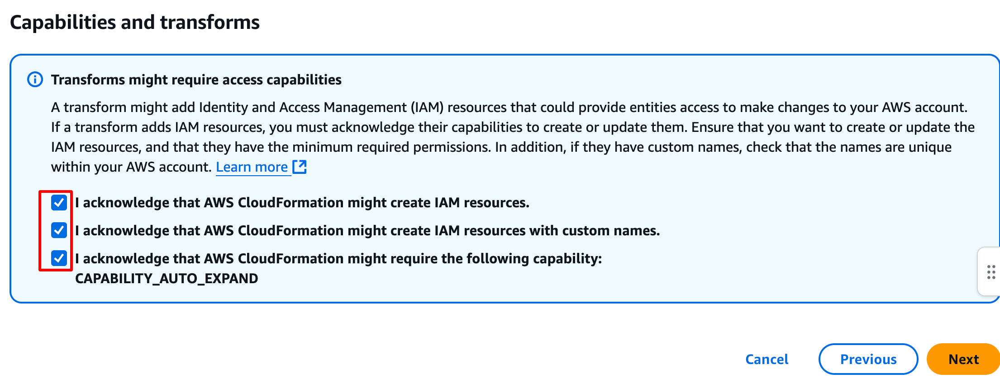

7. Click Submit in Review and create step to start the infrastructure setup.

Once Cloudformation is completed succesfully , following resources will be created in AWS.

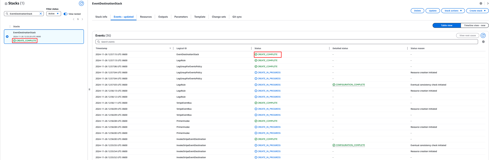

An EventDestination will also be created in Stripe as below. To access Event Destination, login to Stripe Dashboard(https://dashboard.stripe.com/) and click on EventDestination under Developers tab as below

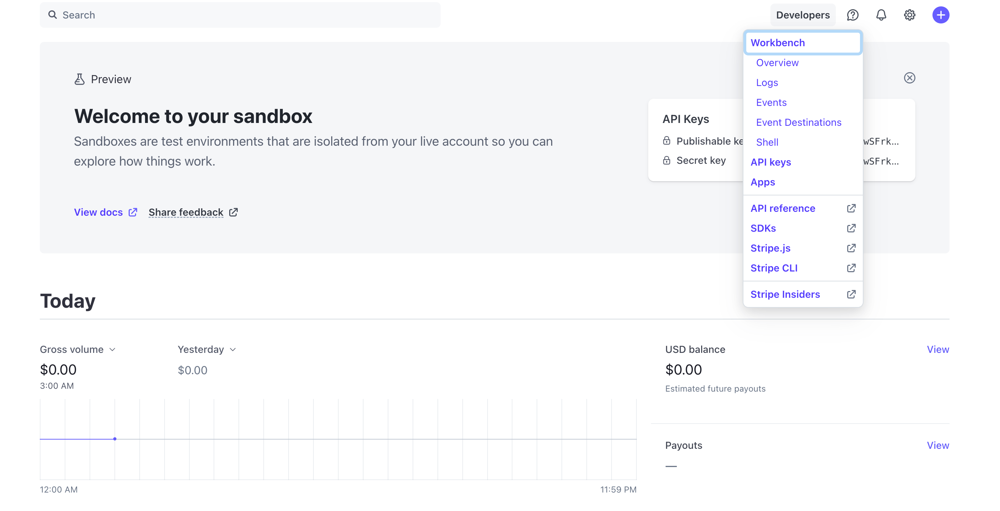

An Active Event Destination will be already created. This event destination is created by lambda function StripeEventDestinationFunction as part of the CloudFormation.

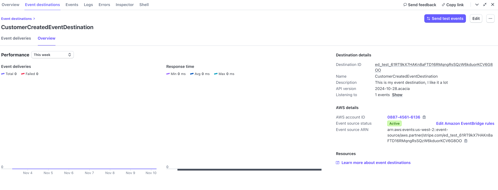

# CloudFormation CLI to create the stack

Aleternatively you can use following CLI command to setup the infrastructure.
```
aws cloudformation create-stack \
  --stack-name CustomerCreatedEventDestinationStack \
  --template-body file://<Cloudformation.yaml file path> \
  --capabilities CAPABILITY_AUTO_EXPAND \
  --parameters \
    ParameterKey=Description,ParameterValue='This is my event destination I like it a lot' \
    ParameterKey=EnabledEvents,ParameterValue=customer.created \
    ParameterKey=EventDestinationName,ParameterValue=CustomerCreatedEventDestination \
    ParameterKey=EventPayload,ParameterValue=snapshot \
    ParameterKey=EventFrom,ParameterValue=self \
    ParameterKey=Metadata,ParameterValue=env\\,test \
    ParameterKey=StripeApiKey,ParameterValue="<<APIKey>>" \
    ParameterKey=StripeAPIVersion,ParameterValue="2024-10-28.acacia"


```
    
# Stack Resources
This stack creates the following main resources:


1. StripeEventDestination - EventDestination in Stripe to capture customer.created events.
2. StripeEventDestinationFunction - Lambda function that calls CreateEventDestination API to create StripeEventDestination . This Lambda can be further reused to create EventDestinations.
3. InvokeStripeEventDestination - Lambda function created to invoke StripeEventDestinationFunction as part of the CloudFormation and update the CloudFormation stack status.
4. EventBus(AWS::Events::EventBus) - An EventBus to associate Stripe Partner Event Source with EventBus.
5. LogsRule(AWS::Events::Rule) - A LogRule to move the events from EventBus to CloudWatch LogGroup.
6. LogGroupForEvents(AWS::Logs::LogGroup) - A LogGroup to log  Stripe events.

Apart from above IAM resources will be created to associate neccesary permissions to Lambda

# Testing Stripe EventDestination Flow

The CloudFormation stack created neccesary infrastructure to log customer.created events from Stripe to AWS CloudWatch LogGroup.

Login into Stripe Dashboard (https://dashboard.stripe.com/) . Click on Customers link and Click Create Customer as below.

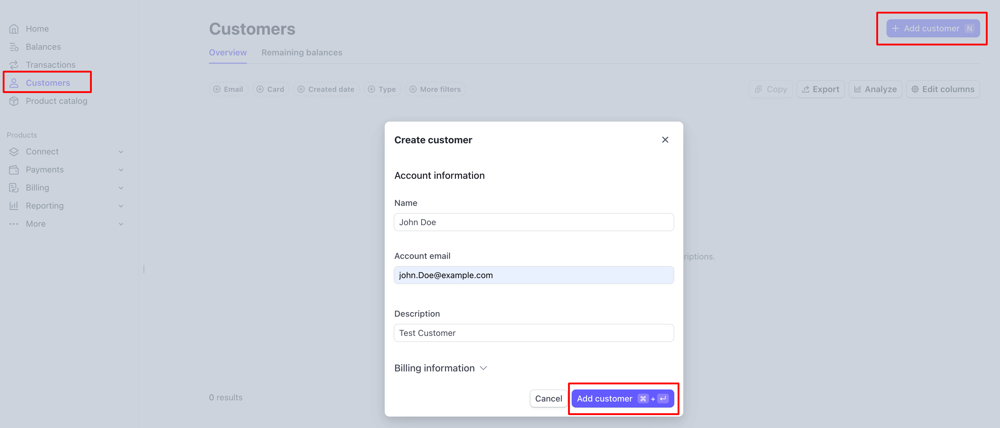

Open CloudWatch Log Group "/aws/events/stripeeventbridge" and  John Doe customer.created event will be in the CloudWatch log as below.

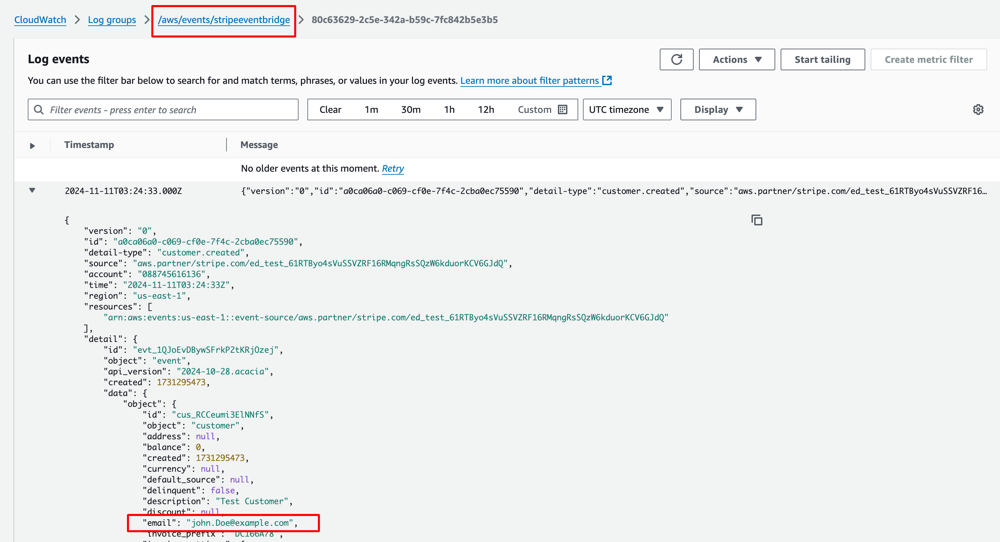


# Cleanup
To remove all AWS created resources, delete the CloudFormation stack:

    
aws cloudformation delete-stack --stack-name <<StackName>>

To remove Stripe EventDestination, login into Stripe Dashboard and click on workbench --> EventDestion and Click on Delete as below

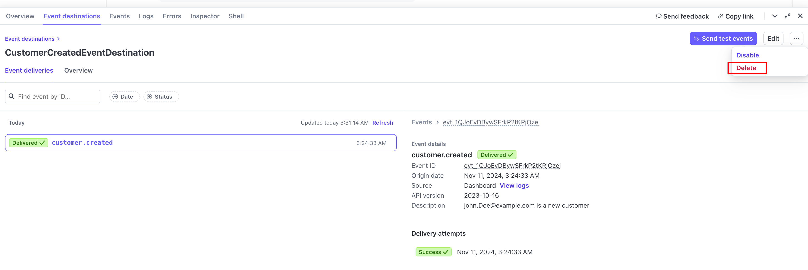
    

    
# Troubleshooting
If the stack creation fails, check the CloudFormation events in the AWS Console for error messages.
Ensure that your Stripe API key is correct and has the necessary permissions.

# Security Note
The Stripe API key is stored as a secure string in CloudFormation. However, ensure you follow Stripe best practices(https://docs.stripe.com/keys-best-practices) for managing sensitive information.

# Contributing
Feel free to submit issues or pull requests if you find any problems or have suggestions for improvements.
